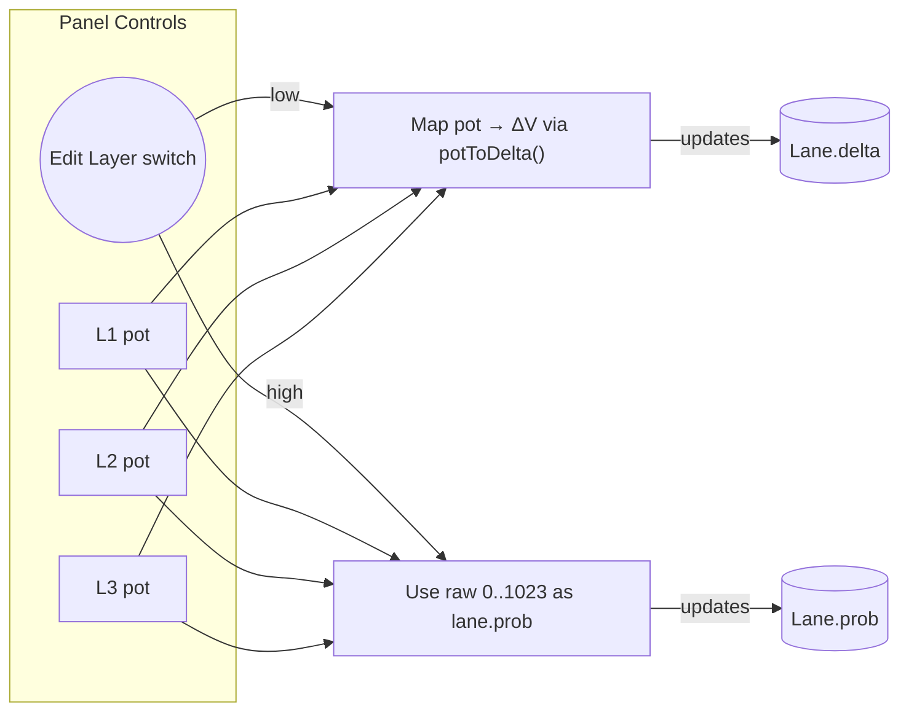

# Firmware Design

## Event model (3 lanes)
- **Lane 1 (rise):** on rising gate/trigger, add/subtract ΔV (set by bipolar pot)
- **Lane 2 (fall):** on falling gate, add/subtract ΔV
- **Lane 3 (threshold):** compare CV_in to threshold (>,< via switch); on crossing, add/subtract ΔV

All lanes accumulate into a logical 10-bit range 0..1023 → mapped to 0..5 V.

## Modes
- **Clip vs Wrap:** either clamp to 0..FS or wrap (modulo full-scale)
- **Bounce selector:** single button cycles L2-only → L3-only → both → none on release; a 0.8 s hold instantly nukes back to "none" and the release doesn’t advance.
- **Resets:** gateable resets (e.g., L1&L2; ALL)
- **Probability layer:** second UX layer activated with the EDIT switch; lets each lane decide how often to obey its trigger

### Editing layers (pot multiplexing)

We keep the panel minimal by letting the same three pots serve two jobs. Flip the `EDIT LAYER` toggle low (default) to sculpt bipolar deltas; flip it high to sculpt trigger probabilities. The firmware never overwrites the "other" value while you're tweaking, so you can bounce between modes without losing your step sizes.

### Probability gating 101

- Each lane owns a `prob` field (0 = never, 1023 = always). We seed the RNG with the offset pot so it gets a noisy-ish startup value.
- When a lane's trigger condition hits, we call `shouldStep()` before applying the delta. That helper pulls a 10-bit random number so the comparison is intuitive.
- You still get all the same wrap/bounce/reset behavior; probability just says "eh, maybe not this time" before the lane moves.

## Build targets

| Target | File | Outputs | Notes |
|---|---|---|---|
| PWM | `fw/ae_genseq.ino` | D3, D10, D5, D9 → RC → buffer | Minimal BOM; slight PWM ripple; you can raise PWM carrier via timer tweaks |
| DAC | `fw/ae_genseq_dac.ino` | MCP4922×2 (L1/L2 on chip A, L3/SUM on chip B) | Clean 12-bit CV; needs SPI wiring and VREF care |

### SPI DAC wiring (quick ref)
- Common: MOSI, SCK, GND, +5 V
- Chip selects: `CS_A` (L1/L2), `CS_B` (L3/SUM)
- VREF = 5 V (decouple with 100 nF + 10 µF)
- LDAC tied low (or GPIO for simultaneous update)
- DAC outputs → `lane_dac_buf` → jacks
